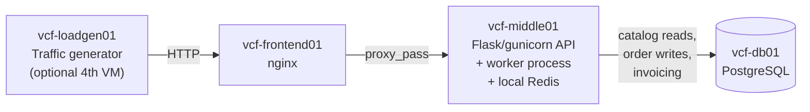

# ShopFlow architecture

## Request flow

1. `vcf-loadgen01` simulates concurrent shoppers hitting `vcf-frontend01`
   (or run it from any machine that can reach the frontend if you're
   keeping the lab to 3 VMs).
2. nginx on `vcf-frontend01` reverse-proxies everything to the API
   process on `vcf-middle01`.
3. Catalog browsing (`GET /api/catalog/products`, `GET
   /api/catalog/featured`) is cache-first against the Redis instance
   running locally on `vcf-middle01`, falling back to `vcf-db01` on a
   miss.
4. Checkout (`POST /api/checkout`) inserts a `PENDING` order row into
   Postgres and pushes a job onto a local Redis list; the API responds
   `202 Accepted` immediately rather than waiting for invoicing.
5. A separate worker process, also on `vcf-middle01`, consumes that
   queue, looks up the order, applies whatever promo code was used,
   writes the final invoice total back to Postgres, and adjusts
   `products.stock_qty`.

## What's seeded into this environment

Two separate issues, on two different rhythms, so the exercise rewards
correlating multiple signals instead of chasing the first suspicious
graph:

1. A logic bug in the worker process's discount calculation that, for a
   narrow and easy-to-miss combination of inputs, throws an exception
   partway through a database transaction — and the surrounding code
   doesn't clean up after itself. Slow-building, tens of minutes per
   cycle, and it looks like a middle-tier/DB problem from the outside
   even though nothing about the failure is obviously a "leak."
2. A cache configuration issue on the API process that causes a small,
   repeating burst of extra database load. Fast, roughly every 8
   seconds, and independent of issue #1 — a second, smaller thing worth
   noticing and separating from the main incident.

Full detail, expected metrics, and the troubleshooting path through both
lives in `INSTRUCTOR_GUIDE.md`. Deliberately not in this file, in case
trainees have read access to the deployment repo.

## Ports / endpoints reference

| Component        | Port | Path              | Purpose                            |
|-------------------|------|-------------------|--------------------------------------|
| frontend (nginx)  | 80   | `/`               | Public entry point                   |
| frontend (nginx)  | 8081 | `/nginx_status`   | Telegraf scrape (localhost only)     |
| middle (API)      | 8080 | `/healthz`        | nginx upstream health check          |
| middle (redis)    | 6379 | —                 | App cache + job queue (localhost)    |
| db (postgres)     | 5432 | —                 | Primary datastore                    |

No `/metrics` endpoint anywhere by design — see `monitoring/METRICS.md`
for what VCF Operations pulls from each tier instead.
